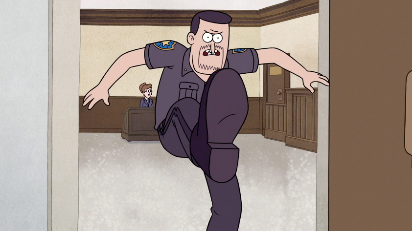

# Software quality = ...

<!-- There are many different definitions of quality. 
- "capability of a software product to conform to requirements." 
- "customer value" 
- defect level
--> 

## Functional quality
Functional requirements compliance = **it does what it is supposed to do**

## Structural quality 
Robustness and maintainability = **it works as designed**

# Measuring software quality

## Capers Jones


> Software quality in 2012: a survey of the state of the art

### Few figures
- From 1984 through 2012
- 24 countries
- 675 companies
- 13,000 projects

### Bugs introduction


### Bugs detection


<!-- 
It can be difficult without a proper infrastructure to begin testing before everything is ready.
But what we also see here is that while bugs are mostly introduced during coding, they are almost never found at that phase. 
--> 

#### The issue with late testing

- Needs to be planned and managed professionally 
- Results in a huge amount of time spent on waiting and rework

<!-- 
- Testers wait for a software version to be tested. 
- Developers wait for test results to start debugging and fixing. 
- Testers wait for the fixes to be re-tested. 
- The debt of testing accumulates towards the later stages of the software flow. Still today, late testing is the most common approach to software quality assurance.
==> Instead of writing new code, developers spend most of their time fixing defects that could have been found earlier
-->

### Bugs fixing costs


- The time and effort it takes to **track down the problem** 
- The challenge of **reproducing defects**

# Shifting Left 

## "Test early, test often"


### Earlier 
- Earlier **testing** = earlier **detection**
- Earlier **detection** = earlier **fixing** 
- Earlier **fixing** = **significant cost reduction**

## Unit testing

- Minimize reliance on late testing 
- Late cycle tests = to prove functionality (**not to find bugs**) 

<!-- Some organizations stop at this point. But you get even more value when you push even further left, into coding itself. After all, this is where bugs are introduced, so let’s start looking for them while development is still working.
-->

## Pushing even further left (into coding)

- Find defects **before testing begins**
- Shrink bug fixing cycle

### 

Coding standards help you avoid bad, dangerous, or insecure code 

### How?
- Apply development and testing best practices (unit tests, inspections and static code analysis) 
- Leverage service virtualization to enable continuous testing (CI)

Finding bugs during the actual coding phase = when the cost is the lowest 

# Capers Jones' take-away

## Quality excellence has ROI > $15 for each $1 spent

## Poor quality is cheaper... 

{ width=60% }

## Quality is vital

Poor quality *< 25% success rate*
Mixed quality *< 50% success rate*
Good quality *> 90% success rate*

# 

## First, waterfall mode / ice cream cone 


## Then, being agile, we test more often but not earlier 


- Unit testing / PBT 
- Integration and NRT
 


## Better development practices

Team programming (pair / mob)

## Quality is not just about being bug-free

### "High quality benefits schedules, productivity, users"
### Ease on-boarding (documentation, code guidelines...)
### Focus efforts in new features instead of bug fixing

# Shifting left even more!

BDD (Unit testing) -> TDD (Tests Driven Development) -> CDD Compiler Driven Development (= Model / Type Driven Development)

# Demo

## Use case


I have some persons in my team for whose I want their favourite programming language (`Front` or `Back`)

### Case 1


### Case 2


### Case 3


### 

## Step 1: Javascript (dynamic weak typing)

```javascript
export const firstRankedLanguageForCategory = (person, category) => {
  if (person.role === "Developer" && person.rankedLanguages !== undefined) {
    return person.rankedLanguages
      .filter(rankedLanguage => rankedLanguage.language.category === category)
      .sort((first, second) => (first.rank < second.rank) ? 1 : -1)
      .pop();
  }
};
```

### Observations 

{ class=gauge }

- A lot of tests to write
- Some un-efficient tests to handle special / error use cases
- We need to wait for tests execution to get feedback

## Step 2: Typescript: let's put some types

```typescript
export const firstRankedLanguageForCategory = (person: Person, category: LanguageCategory): RankedLanguage | undefined => {
  if (person.role === Role.Developer && person.rankedLanguages !== undefined) {
    return person.rankedLanguages
      .filter(rankedLanguage => rankedLanguage.language.category === category)
      .sort((a, b) => (a.rank < b.rank) ? 1 : -1)
      .pop();
  }
};
```

### Observations

{ class=gauge }

- The IDE gives us quick and focused feedbacks
- Less use cases to assess with unit tests

But... 
 
- Still the model can be improved to avoid special cases 
- The model does not clearly fit the reality (ProductOwner can have ranked languages)

## Step 3: Elm: What about a better model design?

{ class=gauge }

- The model is well represented with the type system 
- All cases are handled with the compiler 
- Only functional test cases are represented (focus on what matters)
- No hidden use cases (pattern matching)

## What did we learn?


## Choose your poison! 

### Static vs Dynamic types

When types are checked

#### Dynamic typing

Types checked on the fly, during execution (on runtime)

#### Static typing

```haskell
"3" + 5
<interactive>:3:1: error:
    • No instance for (Num [Char]) arising from a use of ‘+’
    • In the expression: "3" + 5
     In an equation for ‘it’: it = "3" + 5
```
Types checked before run-time

#### Statically typed languages benefits

- Compiler
- Quickest feedback ever

### Strong vs Weak

## Going functional

### Functional vs Imperative patterns

### Immutability
 
## Isolate pure functions to side effects

### Pure function = no side effect

### Identify impure functions
- IO signature
- Algebraic effects

<!--### Test automation to solve all problems? 

#### Waste-reduction solution for the late testing
- Shorten testing time 
- Reduce execution testing cost

#### True. But...
- Often happening after the features are developed (they have more value when being done in parallel)
    - Missing key scenarios
    - Automating useless tests
- Very demanding (most of the effort of the “Test Automation Engineers” is spent battling with automation code and getting the “tests” to work rather than focusing on proper testing and exploring the system.)
- Expansive 
- We learned the hard way (Selenium lovers) 
- And still, the feedback happens late

Global payback of test automation efforts used to be negative in most cases.
Furthermore, it is not an answer to the original problem as the testing feedback still comes a lot later. 
 
-->


# Shift left: *The sooner, the better*

Shifting left is about doing this identification and prevention of defects sooner.
<!-- Many testing activities occur late in the cycle, where it takes longer to figure out problems and costs more to fix them. When you wait to perform testing practices later in the development cycle, your nonfunctional business requirements in particular, such as security and performance testing, are so fundamentally ingrained in your code that all you can really do is patch them up rather than fix them properly.
--> 


