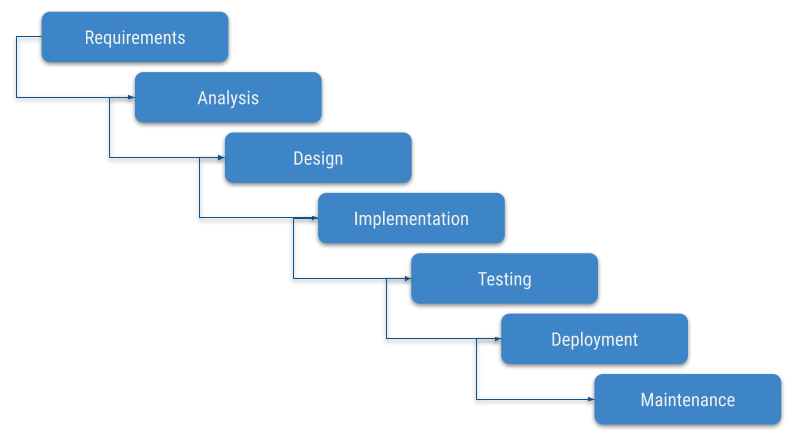

<!--
Use pandoc command to generate the slides with revealjs:
```
pandoc -t revealjs -s -o index.html slides.md -V revealjs-url=https://unpkg.com/reveal.js@3.9.2/ --slide-level 4 --variable theme="solarized" --css=pandoc.css
```
-->
---
title: Shift left
date: Nov 7, 2019
author: Rémi Delgatte (*@rdelgatte*)
---

# Let's kick open doors!{class=with-background-image data-background-image="assets/kick-open-door.png"}

# Software quality {class=with-background-image data-background-image="assets/definition.jpg"}

<!-- There are many different definitions of quality. 
- "capability of a software product to conform to requirements." 
- "customer value" 
- defect level
--> 

## Functional quality
Requirements compliance = **it does what it is supposed to do**

## Structural quality 
Robustness and maintainability = **it works as designed**

# Measuring software quality {class=with-background-image data-background-image="assets/measure.jpg"}

## Capers Jones


> Software quality in 2012: a survey of the state of the art

### Few figures
- From 1984 through 2012
- 24 countries
- 675 companies
- 13,000 projects

### Bugs introduction
{width=100%}

<!--
*Mistakes, misunderstanding... but also when fitting pieces together*
-->

### Bugs detection
{width=100%}
<!--
*You find bugs... when you start testing*

It can be difficult without a proper infrastructure to begin testing before everything is ready.
But what we also see here is that while bugs are mostly introduced during coding, they are almost never found at that phase. 
--> 

#### What's wrong with late testing ?

<ul>
    <li class="fragment" data-fragment-index="0">
        Needs to be planned and managed professionally 
    </li> 
    <li class="fragment" data-fragment-index="1">
        Huge amount of time spent on waiting and bug fixing
    </li> 
</ul>

<!-- 
- Developers wait for test results to start debugging and fixing. 
- Testers wait for the fixes to be re-tested. 
- The debt of testing accumulates towards the later stages of the software flow. Still today, late testing is the most common approach to software quality assurance.
==> Instead of writing new code, developers spend most of their time fixing defects that could have been found earlier
-->

### Bugs fixing costs

{width=90%}

<ul>
    <li class="fragment" data-fragment-index="0">
        Challenge of **reproducing defects**
    </li> 
    <li class="fragment" data-fragment-index="1">
        Time and effort it takes to **track down the problem** 
    </li> 
</ul>

# Shifting Left{class=with-background-image data-background-image="assets/title.jpg"}

## "Test early, test often"

{width=100%}

### Earlier 

<ul>
    <li class="fragment" data-fragment-index="0">
        Earlier **testing** = earlier **detection**
    </li> 
    <li class="fragment" data-fragment-index="1">
        Earlier **detection** = earlier **fixing** 
    </li> 
    <li class="fragment" data-fragment-index="2">
        Earlier **fixing** = **significant cost reduction**
    </li> 
</ul>

## Unit testing

- Minimize reliance on late testing 
- Late cycle tests = to prove functionality (**not to find bugs**) 

<!-- Some organizations stop at this point. But you get even more value when you push even further left, into coding itself. After all, this is where bugs are introduced, so let’s start looking for them while development is still working.
-->

## Further left (into coding)

{width=100%}

Find defects **before testing begins**

### Shrink bug fixing cycle

<span class="fragment" data-fragment-index="0">
    Development and testing best practices (**unit tests, inspections and static code analysis**)
</span> 

<span class="fragment" data-fragment-index="1">
    Service virtualization to enable **continuous testing **
</span> 


# Capers Jones' take-away {class=with-background-image data-background-image="assets/take-away.jpg"}

## Quality excellence ROI {class=with-background-image data-background-image="assets/money.jpg"}

**$4** to **$37** for each **$1 spent**

## Poor quality is cheaper... 

{ width=60% }

# Personal experience {class=with-background-image data-background-image="assets/personal-experience.jpg"}

## First, waterfall mode



### With the ice cream cone 


## Then, being agile, we test more often...


### But still...

It keeps happening too late
 


## Better development practices

### ***DD**


### Team programming (pair / mob)
{ width=60% }

### Code review


## Quality is not just about being bug-free{class=with-background-image data-background-image="assets/blue-sky.jpg"}

### High quality benefits projects, teams & companies
### Ease on-boarding (documentation, code guidelines...)
### Focus efforts in new features instead of bug fixing

# Shifting left even more!{class=with-background-image data-background-image="assets/further-left.jpg"}

## Choose your poison (language)! 

### 

#### Dynamic typing


#### Static typing
{ width=80% }

### Strong vs Weak

{ width=50% }

- Implicit conversion between data types (*type coercion*)
- Ways to escape the language's type rules

# Demo {class=with-background-image data-background-image="assets/demo.jpg"}

## Use case


I want to know my teammates' favourite programming languages (`Front` and `Back`)

### Language 
```json
{
  "name": "Java",
  "category": "Back"
}
```
```json
{
  "name": "Elm",
  "category": "Front"
}
```
### Person 
```json
{
  "name": "Rémi",
  "role": "Developer",
  "languages": [
    {
      "name": "Elm",
      "category": "Front"
    }, 
    {
      "name": "Haskell",
      "category": "Back"
    }, 
    {
      "name": "Java",
      "category": "Back"
    }
  ]
}
```
### Case 1


### Case 2


### Case 3


### 

## Step 1: Javascript 

*(= dynamic weak typing)*

```javascript
export const firstLanguageForCategory = (languageType, person) => {
  if (person != null && person.languages !== undefined) {
    return person.languages
      .filter(language => language.category === languageType)
      .shift();
  }
};
```

### Observations 

{ class=gauge }

**12 unit tests** 

- Feedback **after tests executions**
- Specific code to prevent special / error use cases

## Step 2: Typescript - let's type

```typescript
export const firstLanguageForCategory = (category: LanguageCategory, person: Person): Language | undefined => {
  if (person.languages !== undefined) {
    return person.languages
      .filter(language => language.category === category)
      .shift();
  }
};
```

### Observations

{ class=gauge }

**6 unit tests** (*50% less*)

Still the model can be improved to avoid special cases (`ProductOwner` can have `languages`)

## Step 3: Elm - a better model?

```elm
type Person
    = Developer String (List Language)
    | ProductOwner String
```

### Observations 

{ class=gauge }

**6 unit tests**

**No hidden use cases** (pattern matching)

## Demo conclusion

{width=60%}

*Write less tests by trusting your compiler doing it for you!*

# In the end...

- Quality is the cheapest
- I'll keep shifting left to shorten the feedback loop

# Images and references

- [Codexpanse](https://www.youtube.com/watch?v=C5fr0LZLMAs)
- [Photo by Lukas from Pexels](https://www.pexels.com/photo/person-holding-blue-ballpoint-pen-on-white-notebook-669610/)
- [Photo by Startup Stock Photos from Pexels](https://www.pexels.com/photo/writing-notes-idea-class-7103/)
- [Image by Free-Photos de Pixabay](https://pixabay.com/fr/photos/dictionnaire-focus-livre-mot-texte-1149723/)
- [Photo by K Zoltan from Pexels](https://www.pexels.com/photo/agriculture-blooming-blossom-blue-sky-544554/)
- [Image by pasja1000 from Pixabay](https://pixabay.com/photos/far-view-in-flight-swans-high-3698255/)
- [Photo by Christina Morillo from Pexels](https://www.pexels.com/photo/man-standing-infront-of-white-board-1181345/)
- [Photo by Caleb Oquendo from Pexels
](https://www.pexels.com/photo/shallow-focus-photo-of-road-sign-on-pole-3162073/)
<link href="https://fonts.googleapis.com/css?family=Ubuntu&display=swap" rel="stylesheet">

# Again further left? 

Isolate pure functions from effects

## Pure function = no side effect

```haskell
textLength :: Text -> Int
```

## Tag impure functions

```haskell
logMessage :: Message -> LogLevel -> IO ()
```

## Algebraic effects

```haskell
kafkaBrokerUrl :: Members '[ EnvironmentVariables, Log] r => Sem r Text
```
