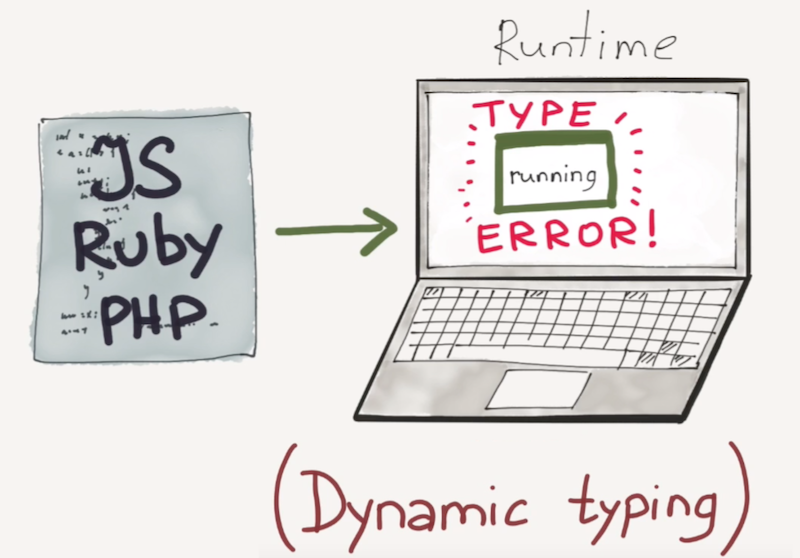

# Let's kick open doors!{class=with-background-image data-background-image="assets/kick-open-door.png"}

# Software quality {class=with-background-image data-background-image="assets/definition.jpg"}

<!-- There are many different definitions of quality. 
- "capability of a software product to conform to requirements." 
- "customer value" 
- defect level
--> 

## Functional quality
Requirements compliance = **it does what it is supposed to do**

## Structural quality 
Robustness and maintainability = **it works as designed**

# Measuring software quality {class=with-background-image data-background-image="assets/measure.jpg"}

## Capers Jones


> Software quality in 2012: a survey of the state of the art

### Few figures
- From 1984 through 2012
- 24 countries
- 675 companies
- 13,000 projects

### Bugs introduction


<!--
*Mistakes, misunderstanding... but also when fitting pieces together*
-->

### Bugs detection

<!--
*You find bugs... when you start testing*

It can be difficult without a proper infrastructure to begin testing before everything is ready.
But what we also see here is that while bugs are mostly introduced during coding, they are almost never found at that phase. 
--> 

#### The issue with late testing {class=with-background-image data-background-image="assets/late-testing.jpg"}

<ul>
    <li class="fragment" data-fragment-index="0">
        Needs to be planned and managed professionally 
    </li> 
    <li class="fragment" data-fragment-index="1">
        Huge amount of time spent on waiting and rework
    </li> 
</ul>

<!-- 
- Developers wait for test results to start debugging and fixing. 
- Testers wait for the fixes to be re-tested. 
- The debt of testing accumulates towards the later stages of the software flow. Still today, late testing is the most common approach to software quality assurance.
==> Instead of writing new code, developers spend most of their time fixing defects that could have been found earlier
-->

### Bugs fixing costs


<ul>
    <li class="fragment" data-fragment-index="0">
        Challenge of **reproducing defects**
    </li> 
    <li class="fragment" data-fragment-index="1">
        Time and effort it takes to **track down the problem** 
    </li> 
</ul>

# Shifting Left{class=with-background-image data-background-image="assets/title.jpg"}

## "Test early, test often"


### Earlier 

<ul>
    <li class="fragment" data-fragment-index="0">
        Earlier **testing** = earlier **detection**
    </li> 
    <li class="fragment" data-fragment-index="1">
        Earlier **detection** = earlier **fixing** 
    </li> 
    <li class="fragment" data-fragment-index="2">
        Earlier **fixing** = **significant cost reduction**
    </li> 
</ul>

## Unit testing

- Minimize reliance on late testing 
- Late cycle tests = to prove functionality (**not to find bugs**) 

<!-- Some organizations stop at this point. But you get even more value when you push even further left, into coding itself. After all, this is where bugs are introduced, so let’s start looking for them while development is still working.
-->

## Further left (into coding)


Find defects **before testing begins**

### Shrink bug fixing cycle

<ul>
    <li class="fragment" data-fragment-index="0">
        Development and testing best practices (unit tests, inspections and static code analysis)
    </li> 
    <li class="fragment" data-fragment-index="1">
        Service virtualization to enable continuous testing (CI)
    </li> 
</ul>

<span class="fragment" data-fragment-index="2">
    **Finding bugs during the actual coding phase = when the cost is the lowest** 
</span> 


# Capers Jones' take-away {class=with-background-image data-background-image="assets/take-away.jpg"}

## Quality excellence has ROI > $15 for each $1 spent

## Poor quality is cheaper... 

{ width=60% }

## Quality is vital
<ul>
    <li class="fragment" data-fragment-index="0">
        Poor quality *< 25% success rate*
    </li>
    <li class="fragment" data-fragment-index="1">
        Medium quality *< 50% success rate*
    </li>
    <li class="fragment" data-fragment-index="2">
        Good quality *> 90% success rate*
    </li>
</ul>

# Personal experience {class=with-background-image data-background-image="assets/personal-experience.jpg"}

## History 

### First, waterfall mode


### And the ice cream cone 


### Then, being agile, we test more often...


### But still...

It keeps happening too late
 


## Better development practices

### ***DD**


### Team programming (pair / mob)
{ width=60% }

### Egoless programming


### Code review


## Quality is not just about being bug-free{class=with-background-image data-background-image="assets/blue-sky.jpg"}

### High quality benefits schedules
### Ease on-boarding (documentation, code guidelines...)
### Focus efforts in new features instead of bug fixing

# Shifting left even more!{class=with-background-image data-background-image="assets/further-left.jpg"}

## Choose your poison (language)! 

### Static vs Dynamic types


#### Dynamic typing

{ width=80% }

#### Static typing
{ width=80% }

### Strong vs Weak

{ width=50% }

- Implicit conversion between data types (*type coercion*)
- Ways to escape the language's type rules

# Demo {class=with-background-image data-background-image="assets/demo.jpg"}

## Use case


I want to know my teammates' favourite programming languages (`Front` or `Back`)

### Model definition 

#### Language 
```json
{
  "name": "Java",
  "category": "Back"
}
```
```json
{
  "name": "Elm",
  "category": "Front"
}
```
#### Person 
```json
{
  "name": "Rémi",
  "role": "Developer",
  "rankedLanguages": [
    {
      "language": { "name": "Elm", "category": "Front" },
      "rank": 1
    },
    {
      "language": { "name": "Haskell", "category": "Back" },
      "rank": 2
    },
    {
      "language": { "name": "Java", "category": "Back" },
      "rank": 3
    }
  ]
}
```

### Case 1


Result calling `Front`:
```json
{
  "language": { "name": "Elm", "category": "Front" },
  "rank": 1
}
```

### Case 2


### Case 3


### 

## Step 1: Javascript 

*(= dynamic weak typing)*

```javascript
export const firstRankedLanguageForCategory = (person, category) => {
  if (person.role === "Developer" && person.rankedLanguages !== undefined) {
    return person.rankedLanguages
      .filter(rankedLanguage => rankedLanguage.language.category === category)
      .sort((first, second) => (first.rank < second.rank) ? 1 : -1)
      .pop();
  }
};
```

### Observations 

{ class=gauge }

12 unit tests 

- Some un-efficient code to handle special / error use cases
- We need to wait for tests execution to get feedback

## Step 2: Typescript: let's put some types

```typescript
export const firstRankedLanguageForCategory = (person: Person, category: LanguageCategory): RankedLanguage | undefined => {
  if (person.role === Role.Developer && person.rankedLanguages !== undefined) {
    return person.rankedLanguages
      .filter(rankedLanguage => rankedLanguage.language.category === category)
      .sort((a, b) => (a.rank < b.rank) ? 1 : -1)
      .pop();
  }
};
```

### Observations

{ class=gauge }

6 unit tests (*50% less*)

- Still the model can be improved to avoid special cases 
- The model does not clearly fit the reality (`ProductOwner` can have `rankedLanguages`)

## Step 3: Elm: What about a better model design?

{ class=gauge }

6 unit tests

- A `Person` can either be `Developer` or `ProductOwner` 
- No hidden use cases (pattern matching)

## Conclusion

*Write less tests by trusting your compiler doing it for you!*

# Again further left? 

Isolate pure functions from effects

## Pure function = no side effect

## Tag impure functions
- IO signature
- Algebraic effects

<!--### Test automation to solve all problems? 

#### Waste-reduction solution for the late testing
- Shorten testing time 
- Reduce execution testing cost

#### True. But...
- Often happening after the features are developed (they have more value when being done in parallel)
    - Missing key scenarios
    - Automating useless tests
- Very demanding (most of the effort of the “Test Automation Engineers” is spent battling with automation code and getting the “tests” to work rather than focusing on proper testing and exploring the system.)
- Expansive 
- We learned the hard way (Selenium lovers) 
- And still, the feedback happens late

Global payback of test automation efforts used to be negative in most cases.
Furthermore, it is not an answer to the original problem as the testing feedback still comes a lot later. 
 
-->


# Shift left: *The sooner, the better*

Shifting left is about doing this identification and prevention of defects sooner.


# Images and references

- [Codexpanse](https://www.youtube.com/watch?v=C5fr0LZLMAs)
- [Photo by Lukas from Pexels](https://www.pexels.com/photo/person-holding-blue-ballpoint-pen-on-white-notebook-669610/)
- [Photo by Startup Stock Photos from Pexels](https://www.pexels.com/photo/writing-notes-idea-class-7103/)
- [Image parFree-Photos de Pixabay](https://pixabay.com/fr/photos/dictionnaire-focus-livre-mot-texte-1149723/)
- [Photo by K Zoltan from Pexels](https://www.pexels.com/photo/agriculture-blooming-blossom-blue-sky-544554/)
- [Image by pasja1000 from Pixabay](https://pixabay.com/photos/far-view-in-flight-swans-high-3698255/)
- [Photo by Christina Morillo from Pexels](https://www.pexels.com/photo/man-standing-infront-of-white-board-1181345/)
<link href="https://fonts.googleapis.com/css?family=Ubuntu&display=swap" rel="stylesheet">
